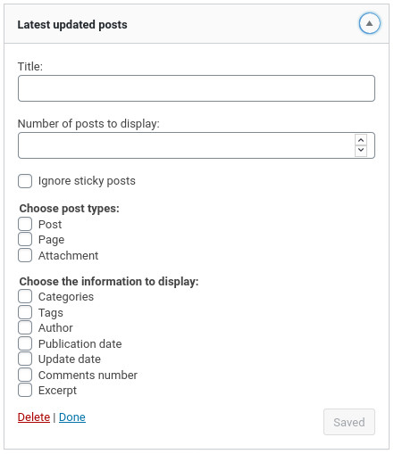
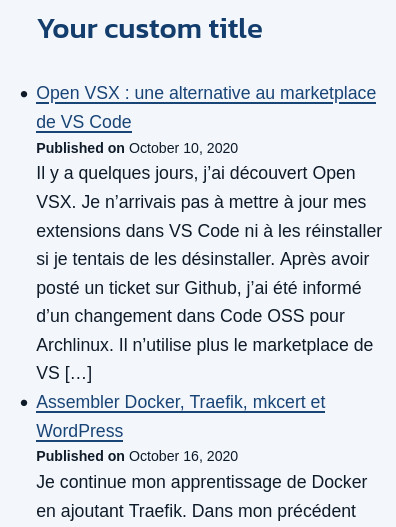

# Latest Updated Posts Widget

 

A WordPress Widget to display a list of the latest updated posts.

## Presentation

This widget can be place in your sidebar to display the latest updated posts. Unlike the native "_Recent Posts_" widget that displays the recently published posts, this one lists the posts that have been recently modified.

The widget allows you to choose:

-   between the default post types and your custom post types
-   which data to display (dates, excerpt...)

If you have sticky posts, you may want checked "_Ignore sticky post_" to prevent them to appear at the top of the list.

**By choice:** if a post is modified on the same day as its publication, it will not be displayed.

## Installation

### Composer installation

You can use Composer to install this plugin as a dependency if you use custom installers:

```
{
"require": {
    "armandphilippot/latest-updated-posts-widget": "dev-master"
}
"repositories": [{
    "type": "git",
    "url": "git@github.com:ArmandPhilippot/latest-updated-posts-widget.git"
}]
```

### Manual installation

You can download this plugin on Github, then extract it in `/wp-content/plugins/` directory.

## Usage

1. Navigate to the "_Plugins_" dashboard page and click on "_Activate_".
2. Add "_**Latest updated posts**_" to a widget area through the "_Widgets_" menu in WordPress.
3. Configure settings.

## Screenshots

| Admin view - Common                                        | Admin view - with Custom Post Types                         |
| ---------------------------------------------------------- | ----------------------------------------------------------- |
|  |  |

| Public view - example 1                                      | Public view - example 2                                       |
| ------------------------------------------------------------ | ------------------------------------------------------------- |
|  |  |

## License

This project is open source and available under the [GPL v2 or later License](https://github.com/ArmandPhilippot/latest-updated-posts/blob/master/LICENSE).
